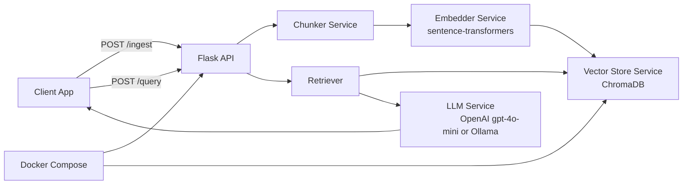

# rag-flask-mongo

Production-style Retrieval-Augmented Generation API built with Flask, sentence-transformers, ChromaDB, and OpenAI or Ollama.

## Architecture



## Quickstart

Run the full stack with one command:

```bash
docker compose up --build
```

API endpoint:
- http://localhost:5000

## API Examples

### 1. Ingest a PDF file

```bash
curl -X POST "http://localhost:5000/ingest" \
	-F "file=@/absolute/path/to/handbook.pdf" \
	-F "collection_name=default"
```

### 2. Query the indexed content

```bash
curl -X POST "http://localhost:5000/query" \
	-H "Content-Type: application/json" \
	-d '{
		"question": "Summarize the key points from the handbook.",
		"top_k": 4,
		"collection_name": "default"
	}'
```

### 3. Optional streaming query

```bash
curl -N -X POST "http://localhost:5000/query?streaming=true" \
	-H "Content-Type: application/json" \
	-d '{"question": "What are the deployment steps?", "top_k": 4}'
```

## Design Decisions

### Why sentence-transformers

- Uses a strong, open embedding baseline with good semantic quality per compute cost.
- all-MiniLM-L6-v2 is fast enough for local development and small production workloads.
- Embeddings are normalized at generation time, which simplifies similarity math.

### Why normalized embeddings matter

- With L2-normalized vectors, cosine similarity and dot product are equivalent:
	- cosine(a, b) = (a · b) / (||a|| ||b||)
	- if ||a|| = ||b|| = 1, then cosine(a, b) = a · b
- This gives simpler and faster scoring logic with no loss of ranking quality for normalized vectors.

### Why overlapping chunks

- Important facts often span sentence boundaries.
- Fixed overlap reduces boundary loss and improves recall during retrieval.
- Current default overlap of 64 tokens balances context continuity and index size.

### Why ChromaDB now

- Lightweight setup, easy local persistence, and fast iteration speed.
- Works both as embedded persistent storage and as a standalone service in Docker.
- Good fit for prototyping and portfolio projects where setup friction should be minimal.

### Query-time retrieval tradeoff

- Simpler RAG systems often load many vectors into memory and score in-process because it is easy to debug and reason about.
- Tradeoff:
	- Pro: straightforward implementation and deterministic behavior.
	- Con: memory and latency degrade as corpus size grows.
- In this implementation, Chroma handles vector indexing/querying, which is more scalable than fully in-memory scanning.

### What to replace in production

- Migrate retrieval to MongoDB Atlas Vector Search for managed indexing, filtering, and operational scale.
- Keep the API contract stable while swapping the vector backend behind the VectorStore abstraction.

## Storage Schema

### Current persisted shape in ChromaDB

Each indexed chunk is stored as:

```json
{
	"id": "7d7376cc-3d0d-4ba4-8be1-cd826a2e9ad8",
	"document": "Chunk text content...",
	"embedding": [0.0123, -0.0441, 0.0812],
	"metadata": {
		"source": "handbook.pdf",
		"page": 3,
		"chunk_index": 12,
		"ingested_at": "2026-06-05T19:22:11.392145+00:00"
	}
}
```

### MongoDB document schema for Atlas migration

Equivalent MongoDB shape to store per chunk:

```json
{
	"_id": "7d7376cc-3d0d-4ba4-8be1-cd826a2e9ad8",
	"source": "handbook.pdf",
	"page": 3,
	"chunk_index": 12,
	"text": "Chunk text content...",
	"embedding": [0.0123, -0.0441, 0.0812],
	"ingested_at": "2026-06-05T19:22:11.392145+00:00",
	"collection_name": "default"
}
```

## What I Would Add Next

1. Async ingestion queue with Celery
	 - Offload PDF parsing, chunking, and embedding to workers.
	 - Add job IDs and status endpoints for non-blocking ingestion.

2. Atlas Vector Search migration
	 - Replace Chroma with managed vector indexes.
	 - Add metadata filtering and hybrid search patterns.

3. Auth with Flask-JWT
	 - Protect ingest/query routes.
	 - Add tenant-aware claims to support data isolation.

4. Multi-tenancy and policy controls
	 - Namespace collections by tenant.
	 - Add per-tenant rate limits and usage telemetry.

5. Streaming UX hardening
	 - Improve SSE retry/resume behavior.
	 - Add structured event schema for frontend clients.